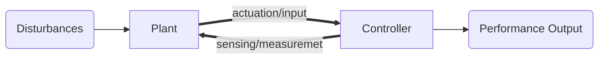

This would be a mermaid graph. But this is also not rendered in either the implemented export or print…

# The Diagram

# Zettelkasten References

Reference to [[20240728173317]] Sample 1 and [[20240728223001]] Sample 4: Math Test.

This Reference points outside! [[20240315122442]] Secrets

## What about $\lambda > 0$?

- [ ] Check if Latex in title works
- [ ] Check if To Do list work
    - [ ] even if indented
    - [x] and checked

# Emojis!🎉

What was missing?🕵️

Yes! Emojis!🐳 So professional!💥