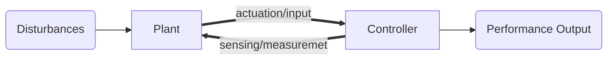

```mermaid
graph LR;
	dist(Disturbances)
    out(Performance Output)
    plt[Plant]
    ctr[Controller]
    dist  --> plt
    ctr == "sensing/measuremet" ==> plt
    plt == "actuation/input" ==> ctr
    ctr --> out
```