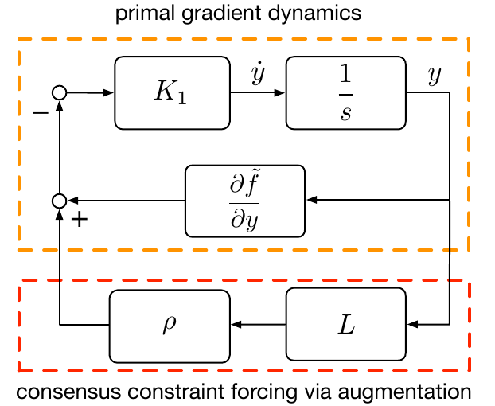

A way to solve a [[20250419112329]] Distributed Optimization Problem.

Run [[20250419101546]] Gradient Descent (GD) on modified objective and enforce consensus via the [[20250419221113]] Laplacian Matrix in a soft-constraint.

Convergence exactly with time varying gain (= vanishing steps) or "large enough" soft-constraint.

---

# Basics

- modified objective
    - $\boxed{\min_y \tilde{f}(y) + \frac{\rho}{2}y^\top L y}$
    - can interpret additional part as a _soft constraint_ to enforce consensus
    - $y$, $\tilde{f}$ as in [[20250419112329]] Distributed Optimization: _Equivlanet Formulation_
- **gradient flow**
    - $\boxed{\dot{y} = -K_1\frac{\partial \tilde{f}(y)}{\partial y} - \rho K_1Ly}$
    - motivation for this: look at evolution of average of $y_i$ and plug in, see that for average the soft constraint drops out (due to properties of $L$). But need to have that $y_i=y_j$ when writing it in component form.<!--slide 20-->

## Block Diagram

- 
    - top (orange): primal gradient, as in [[20250419101546]] Gradient Descent (GD)
    - bottom (red): enforce consensus via soft penalty

# Convergence

## Hand-wavy
Idea: make $\rho$ "much larger" than $K_1$ ↝ enforce consensus i.e. $Ly^\ast \approx 0_n$

## Time-Varying Gains
<!--Theorem 2.4-->
- Idea
    - Gain $K_1\to K_1(t) = \alpha(t)$
    - goes to 0 but not too fast as need to still move to optimum
    - in limit, consensus needs to dominate

- Setting
    - $\tilde{f}: \mathbb{R}^n\to\mathbb{R}$ … function (from modified objective)
        - twice continuously differentiable
        - strictly convex
        - radially unbounded
    - $\alpha: \mathbb{R}_{\geq0}\to\mathbb{R}_{>0}$ … time-varying gain
        - $\alpha(t) > 0$
        - $\lim_{t\to\infty} \alpha(t) = 0$
        - $\int_0^\infty \alpha(t) \ dt = \infty$ … all 3 conditions: _persistence condition_
- Result
    - converges to global minimizer $y^\ast = x^\ast 1_n$
 
- Notes
    - in _discrete_ … **vanishing steps**
    - in practice: _useless_ as takes quite a long time due to these vanishing steps
    - to get rid of them → [[20250420064704]] Gradient Tracking Flow